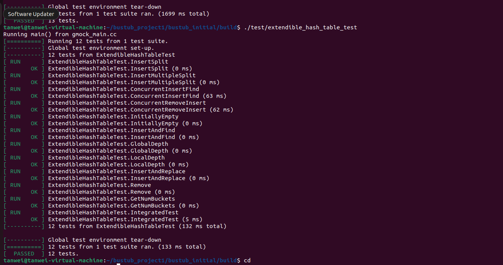
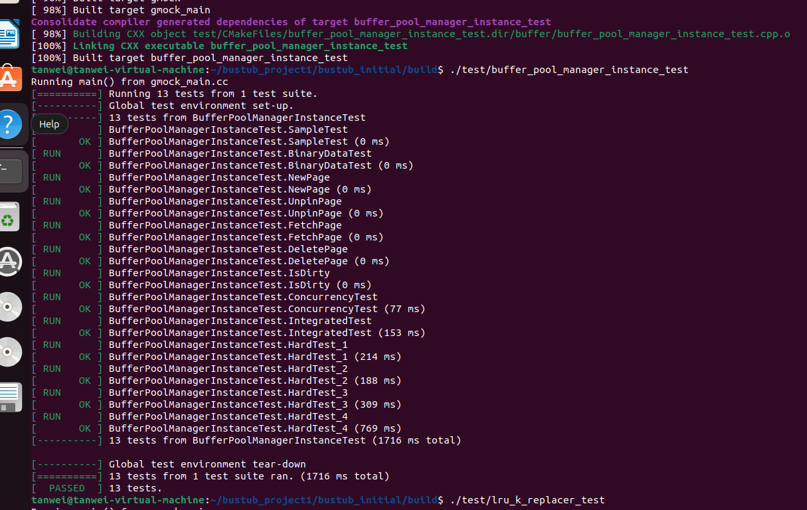
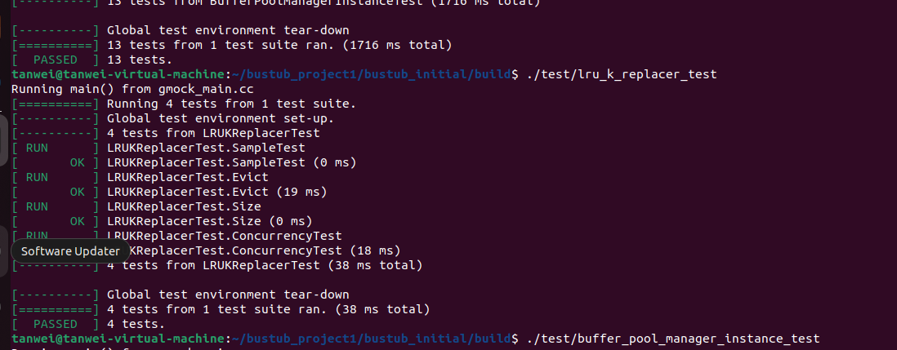
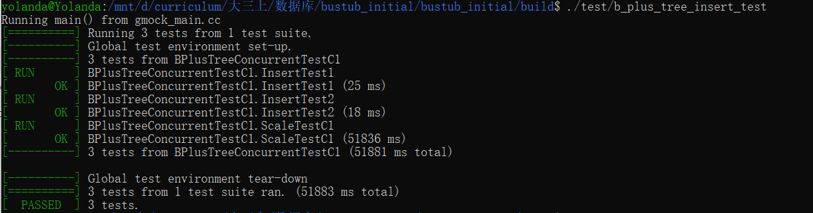
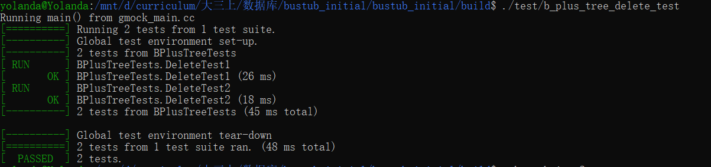
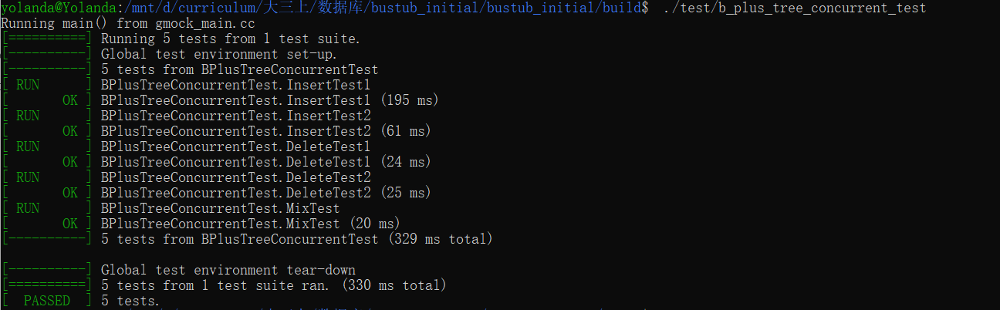

# 数据库作业

组长:

姓名:朱雅诗

学号:2023141460305

组员:

姓名:谭葳

学号:2023141460312

姓名:何烨

学号:2023141460310

- 数据库作业
  - 第一次编程作业
    - extendible_hash_table_test
    - buffer_pool_manager_instance_test
    - lru_k_replacer_test
  - 第二次编程作业
    - b_plus_tree_insert_test
    - b_plus_tree_delete_test
    - b_plus_tree_concurrent_test
    

## 第一次编程作业
### extendible_hash_table_test

### buffer_pool_manager_instance_test

### lru_k_replacer_test

## 第二次编程作业
### b_plus_tree_insert_test

### b_plus_tree_delete_test

### b_plus_tree_concurrent_test

 
